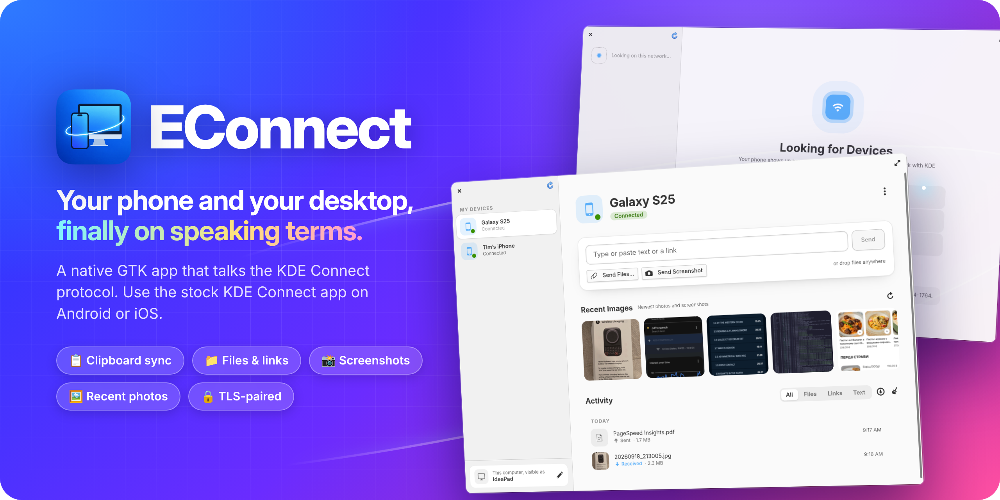

# EConnect



A small GTK4 app that talks the KDE Connect protocol, so the stock KDE Connect app on your Android or iOS phone works with it unchanged.

## Features

- Pair with phones on the same Wi-Fi network
- Clipboard sync in both directions
- Send and receive files, links and text
- Take a screenshot and send it to the phone
- Preview of the newest photos and screenshots from the phone
- Activity list of everything sent and received, with per-file progress and drag-and-drop sending

## Build and install

EConnect is built as a Flatpak. You need Flatpak with the Flathub remote, and Flatpak Builder:

```sh
flatpak install --user flathub org.flatpak.Builder
```

Get the source:

```sh
git clone https://github.com/gornostal/EConnect.git
cd EConnect
```

Build and install from the repository root:

```sh
flatpak run org.flatpak.Builder --user --install --force-clean --install-deps-from=flathub build-flatpak io.github.gornostal.econnect.yml
```

Run with `flatpak run io.github.gornostal.econnect`, or from the applications menu.

For development without Flatpak, install meson, valac and the GTK 4, Granite 7, json-glib and GnuTLS development packages, then run `meson setup build && ninja -C build`. This also builds `econnect-cli`, a headless test tool.
